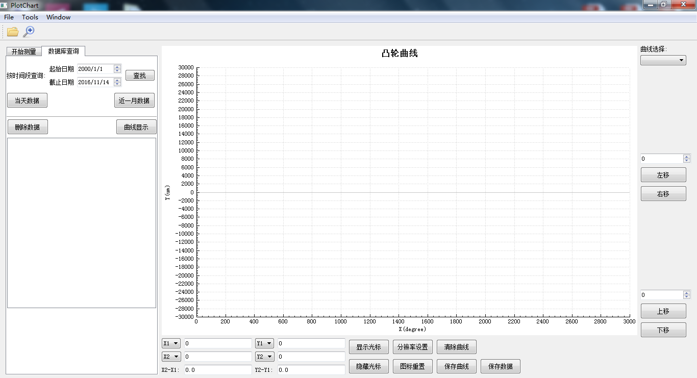

+++
title = "README"
date = "2017-05-18T14:45:25+08:00"

+++

1.  概述
---------

这份文档详述了基于Qt使用第三方开源库QCustomPlot 开发的Plot（以下简称QtPlot）.

2.	Qt Plot Feature Description
---------
*   **界面布局**
    -   最大化显示，随屏幕组建可扩展。

*   **两条虚线轴，可拖动**
    -   图标中可生成至少两条虚线轴（目前），虚拟轴可移动，标注显示曲线的X、Y轴坐标。

*   **读取本地数据文件，生成图像**
    -   读取可生成两条曲线的数据文件（.csv）,在图表中生成图像。

*   **鼠标操作**

    *Zoom*
      -   左击鼠标拖动，出现区域选择，释放鼠标后，图标显示选中范围。左击从左上角向右下角称为正向拖动，则放大选中区域。左击从右下角到左上角，称为逆向拖动，则恢复到放大前的原样。

    *右键拖动*
      -  右键拖动鼠标，移动整个图标图层。

3.	Qt Plot Implement
---------

